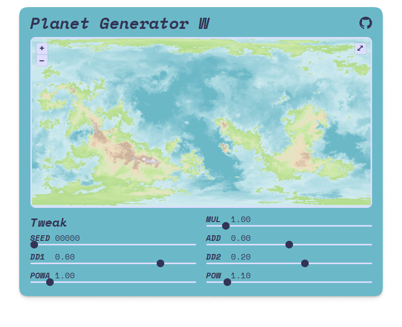

# planet-generator-w

Based on [_Planet Generator_](http://hjemmesider.diku.dk/~torbenm/Planet/) by Torben Mogensen

> [!NOTE]
> Rendered result can be differ (dramatically) upon devices, even if every parameter is same.

## How It Works?

See [_Planet Map Generation by Tetrahedral Subdivision_](http://hjemmesider.diku.dk/~torbenm/Planet/PSIslides.pdf) by Torben Mogensen.

This project adds OpenLayers and WebGPU on top of the Tetrahedral Subdivision to make interactive map.

## About Tweaks

- `SEED` is seed.
- `final altitude` = `original altitude` * `MUL` + `ADD`
- Rest of tweaks: honestly, I don't understand what they exactly are. I merely exposed the constants in the original code as-is.
    - `DD1`: weight for altitude difference
    - `POWA`: power for altitude difference
    - `DD2`: weight for distance
    - `POW`: power for distance function

## Copyright Policy

The same copyright policy as the original [Planet Generator](http://hjemmesider.diku.dk/~torbenm/Planet/) applies.

> Both the program itself and maps created by the program are free for use, modification and reproduction, both privately and for commercial purposes, as long as this does not limit what other people may do with the program and images they produce with the program. For example, you can not copyright an image produced by the program unless you have substantially modified it afterwards, because other people might use the same parameters as you used to produce the same image. If you add code to the program that you do not wish to share, you can claim copyright for the code you write yourself, but that does not extend to the program as a whole.
